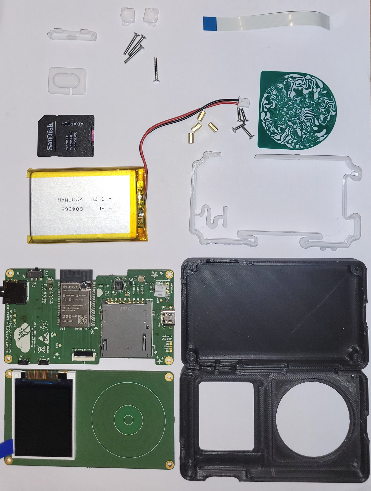
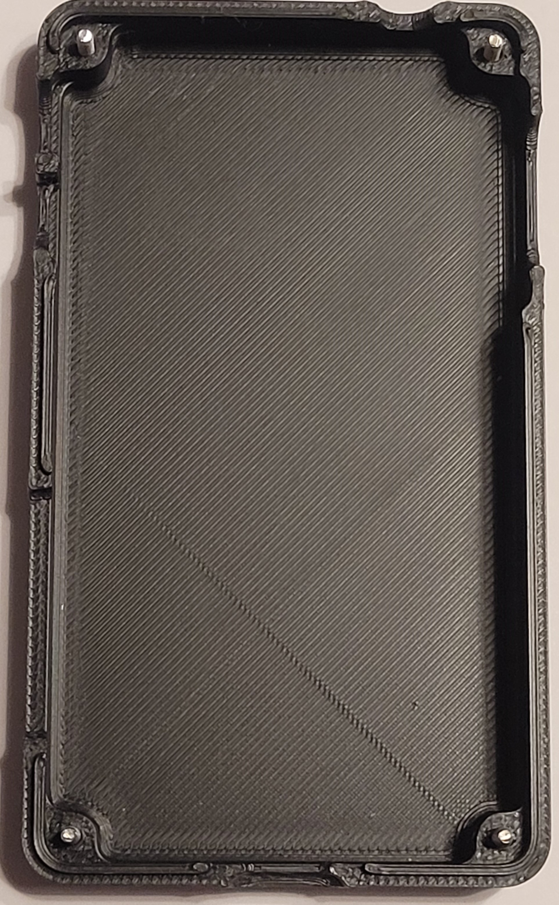
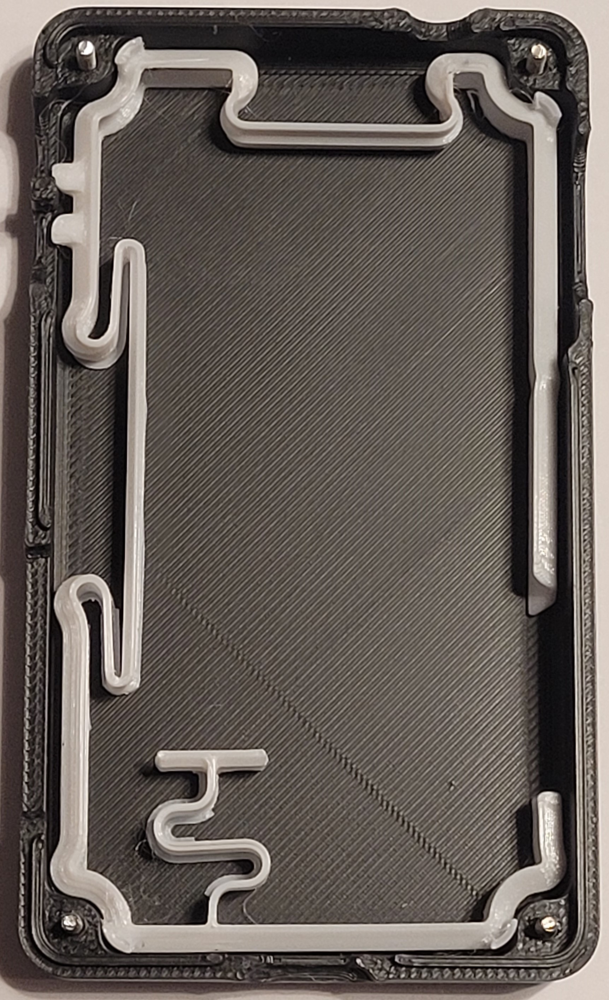
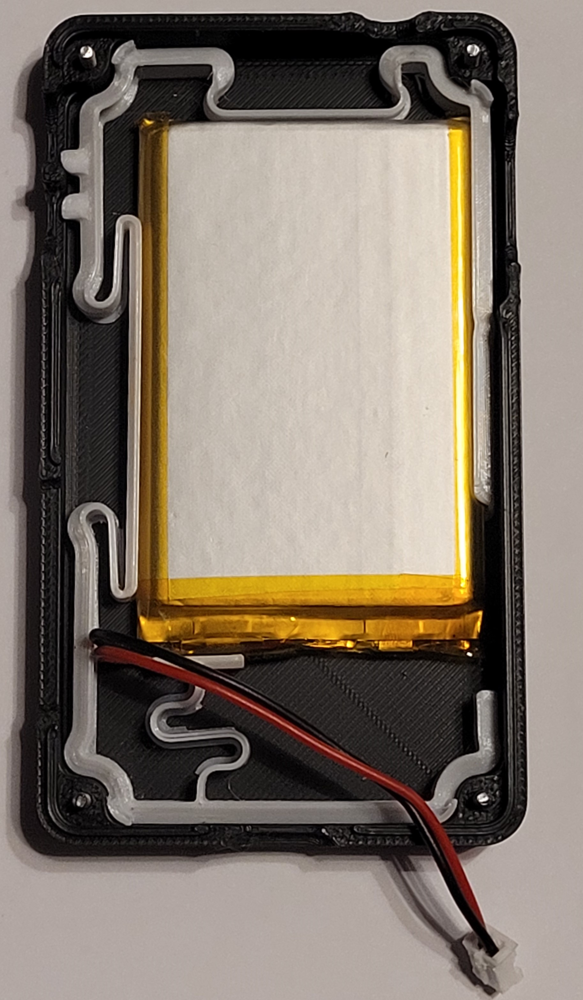

# Tangara-Workshop

## Kosten
Der Workshop kostet 100€. Am liebsten in Bar im Notfall per Paypal.
## Voraussetzung
Erfahung mit dem SMD-Bestücken von Platinen oder gute Augen, eine ruhige Hand und Geduld. 
## Mitbringen
- Zwingend
    - Laptop/Tablet/Smartphone zum ansehen der Anleitung
- Optional
    - Außensechskant 3mm (z. B. https://www.amazon.de/dp/B001553QW8)
    - Torx T5 (z. B. https://www.amazon.de/dp/B0B61C6YSX)
    - Pinzette
    - Kopfhörer mit 3,5 mm Klinke
    - Kopfhörer mit Bluetooth

## Anleitung

### Schritt 1 - Bestücken der Top-Seite des Mainboards
Als erstes musst du die Datei [mainboard.html](mainboard.html) aus diesem Repository herunterladen (mit dem "Download raw file" Button) und im Browser öffnen. Die Datei (ibom) enthält eine Liste der Bauteile, die du bestücken musst und zeigt an, wo diese auf der Platine hingehören. Du musst als erstes die Top-Seite auswählen, indem du oben rechts den Button mit "F" auswählst.

Nun wird die Topseite des Mainboards mit Lötpaste versehen, indem diese mit Hilfe der Lötschablone aufgerakelt wird.
Gehe hierzu zur Rakelstation dort bekommst du deine Mainboard-Platine.

**Bitte beachte, dass wir bleihaltige Lötpaste verwenden, weshalb du darauf achten solltest, in den Pausen immer deine Hände zu waschen, bevor du etwas isst oder trinkst.**

Ist die Platine mit Lötpaste versehen, bekommst du eine Sortierbox mit den Bauteilen für die Top-Seite der Mainboard Platine. Diese Bauteile musst du entsprechend der ibom mit Hilfe der Pinzette bestücken. Die Bauteile in der Sortierbox sind in der gleichen Reihenfolge angeordnet wie in der ibom.

Bitte beachte, dass L1 und L2 das gleiche Bauteil sind. Keine Ahnung warum es zwei Zeilen in der ibom gibt.

Bist du fertig mit dem Bestücken begib dich vorsichtig mit deiner Platine zur Backstation. Achte darauf, dass du nicht auf die Oberseite greifst und Teile verschiebst. Hier kommt die Platine zum ersten Mal in den Ofen.

### Schritt 2 - Pause
Mache eine kleine Pause während der Ofen seinen Job erledigt. Es wird noch anstrengend genug. Das war erst der Anfang. Lauf eine Runde. Wasche deine Hände und trink einen Schluck Wasser, streck deinen Rücken, was auch immer dir hilft :)

### Schritt 3 - Bestücken der Bottom-Seite des mainboards
Schalte die ibom für die Unterseite um, indem du oben rechts den Button "B" auswählst.

Gehe zur Rakelstation hier wird die Unterseite mit Lötpaste versehen.

Die Bauteile für die Bottom-Seite des Mainboards und der Faceplate bekommst du jetzt in einer weiteren Sortierbox.

Setze die Platine in die Bestückungshilfe. Ansonsten verfahre wie zuvor.

Bitte beachte, dass es zwei Zeilen für 10k Widerstände gibt. Es handelt sich aber um das gleiche Bauteil.

Achte bei den Schaltern SW1 und SW2 darauf, dass sie korrekt, gerade und so weit innen wie möglich platziert sind.

Achte bei der USB-Buchse J6 darauf, dass die Beinchen zentral in den Langlöchern positioniert sind.

J1 und J7 sind THT Bauteile und werden nach dem Backen mit dem Lötkolben festgelötet, also nicht wundern wenn du dafür noch keine Teile hast.

Bist du fertig mit dem Bestücken begib dich vorsichtig mit deiner Platine zur Backstation. Hier kommt die Platine zum zweiten Mal in den Ofen.

### Schritt 4 - Pause
Mache eine kleine Pause während der Ofen seinen Job erledigt. Es ist noch ein gutes Stück. Siehe Pause 1.

### Schritt 5 - Festlöten des Akku-Steckers und der Audio-Buchse
Begib dich zur Reworkstation. Frage dort nach den Steckern. Dann bekommst du zwei Bauteile in die Hand gedrückt.

Löte mit dem Lötkolben den Akku-Stecker J7 und die Audio-Buchse J1 fest.

Im Gegensatz zum Original verwenden wir einen Akku mit nur 2 Leitungen und deshalb auch nur eine Zweipolige Buchse. Setze die Buchse in die Bohrungen ein, die mit "VDD" und "GND" gekennzeichnet sind. Lasse "10k NTC" frei. 

### Schritt 6 - Rework Mainboard
Begibt dich mit dem fertigen Mainboard zur Reworkstation. Dort wird geprüft, ob es Kurzschlüsse gibt und diese werden ggf. beseitigt. 

### Schritt 7 - Bestücken der Bottom-Seite der Faceplate
Lade die Datei [faceplate.html](faceplate.html) aus diesem Repository herunterladen und öffne sie im Browser. Schalte die ibom für die Unterseite um, indem du oben rechts den Button "B" auswählst.

Gehe zur Rakelstation dort bekommst du deine Faceplate-Platine. Hier wird die Bottom-Seite mit Lötpaste versehen.

Verfahre wie zuvor.

Bist du fertig mit dem Bestücken begib dich vorsichtig mit deiner Platine zur Backstation. Hier wird zum dritten Mal gebacken.

### Schritt 7 - Pause
Mache eine kleine Pause während der Ofen seinen Job erledigt. Der Bestückungspart ist fast geschafft.

### Schritt 8 - Festlöten des Vibrationsmotors auf der Bottom-Seite der Faceplate
Begib dich zur Reworkstation. Frage dort nach dem Motor und dem Display. Die bekommst du dann ausgehändigt.

Löte den Vibrationsmotor an die beiden Pads die mit "Haptics" beschriftet sind. Rot an + und Blau an -.

### Schritt 9 - Festlöten des Displayes auf der Top-Seite der Faceplate
Setze die Platine in die Bestückungshilfe.
Löte mit dem Lötkolben das Display fest.
Achte sehr gründlich darauf, dass die kontakte des Kables konkruent mit den Kupferpads auf der Platine platziert sind. Der orangene Teil des Kables sollte nahezu Bündig mit dem Rand der Platine sein.

Fangt erst mit den beiden ganz äußeren Pads an und fragt dann nach ob das so passt. Korrekturen sind nur noch schwer möglich, wenn alles schon verlötet ist.

### Schritt 10 - Programmieren

Begibt dich mit der fertigen Faceplate zur Rework-Station. Dort wird geprüft, ob es Kurzschlüsse gibt und diese werden ggf. beseitigt. 

Gehe danach zur Programmierstation dort werden die Controller mit Firmware versorgt und getestet ob alles funktioniert.

### Schritt 11 - Mechanischer zusammenbau
Wenn alles funktioniert bekommst die mechanischen Teile und den Akku.

Gehe zu deinem Platz zurück und breite die mechanischen Teile vor dir aus.
Du solltest nun folgende Teile vor dir haben:

- 4x Schrauben M2 kurz
- 4x Schrauben M2 lang
- 4x Distanzhülsen M2
- 1x Gehäuse Vorderseite
- 1x Gehäuse Rückseite
- 1x Touchwheel Cover
- 1x Faceplate
- 1x Mainboard
- 1x Akku
- 1x Halterahmen für den Akku
- 2x Druckknöpfe
- 1x Schiebeschalter
- 1x SD-Karte
- 1x Abdeckung für die SD-Karte
- 1x Displayabdeckung

Einen Torx-Schraubendreher und einen Innensechskant musst du dir mit deinem Nachbarn teilen.

Schraube als erstes die langen Schrauben von unten in das Gehäuse für die Rückseite.

Platziere nun den Halterahmen für den Akku wie im Bild abgebildet. Auf der linken Seite des Bildes befindet sich die Öffnung für die Buttons.

Platziere nun den Akku wie im Bild.

Setze nun das Mainboard auf die Schrauben. Achte darauf das Batteriekabel wie abgebildet zu legen.

Schraube nun die Distanzhülsen auf die Schrauben in den Ecken.
Stelle nun sicher, dass der Schalter auf "Aus" steht (untere Stellung). Schließe dann den Akku an.

Nun kannst du den Schiebeschalter einsetzen. Achte darauf dass du ihn vollständig einsetzt.

Jetzt wirds kniffelig. Klappe den schwarzen Arm für das Flachbandkabel nach oben. Stecke nun das Flachbandkabel ein. Achte darauf, dass die "blaue" Seite auf der Oberseite ist und das Kabel vollständig eingesteckt ist. Klappe dann den schwarzen Arm herunter um das Kabel zu sichern..

Nimm nun die Faceplate-Platine und positioniere sie so, dass du auf der gegenüberliegenden Seite nun auch das Flachbandkabel einstecken kannst.

Klappe nun die Faceplate auf die Abstandhülsen. Achte darauf dass sich das Flachbandkabel korrekt zusammenfaltet.
Lege das Touchwheel Cover obenauf.

Ziehe nun die Schutzfolie von der Displayabdeckung.
Vermeide mit deinen Fingern direkt auf die Flächen zu tippen.

Ziehe nun auch die Schutzfolie vom Display und lege die Abdeckung vorsichtig auf das Display.

Jetzt wirds noch kniffliger! Lege vorsichtig die vordere Abdeckung des Tangaras auf die Facplate, versuche vor allem die Displayabdeckung korrekt zu positionieren. Das Touchwheel kannst du auch von der Vorderseite richtig positionieren. Wenn sich die Gehäuse Vorderseite bündig auf der Gehäuse Unterseite positionieren lässt, hast du es fast geschafft.

Schraube den Tangara noch nicht zu! Jetzt musst du noch die Buttons hereinfummeln.
Am besten hälst du den Tangara mit einer Hand gerade so weit zusammen, dass die rechte Seite intakt bleibt und du die Buttons auf der linken Seite gerade so einschieben kannst. Die Bilder zeigen dir ungefähr wie.

Jetzt kannst du den Tangara zuschrauben. Stecke noch die Abdeckung auf die SD-Karte und du bist fertig!

## Weiter Informationen
- https://cooltech.zone/tangara/
- https://www.crowdsupply.com/cool-tech-zone/tangara