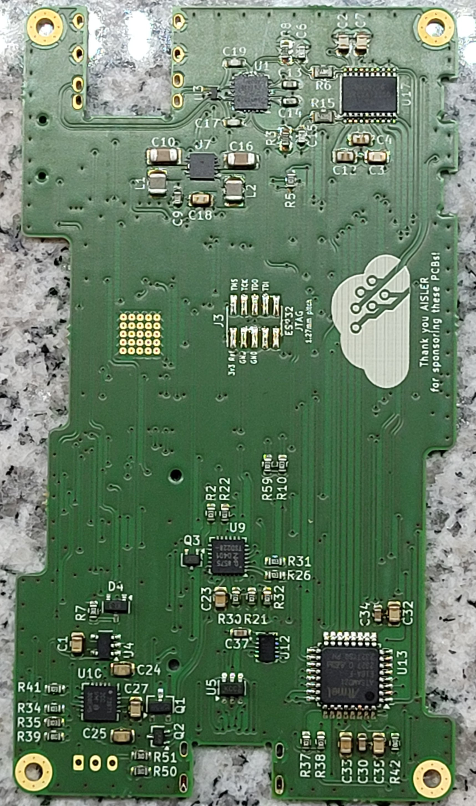
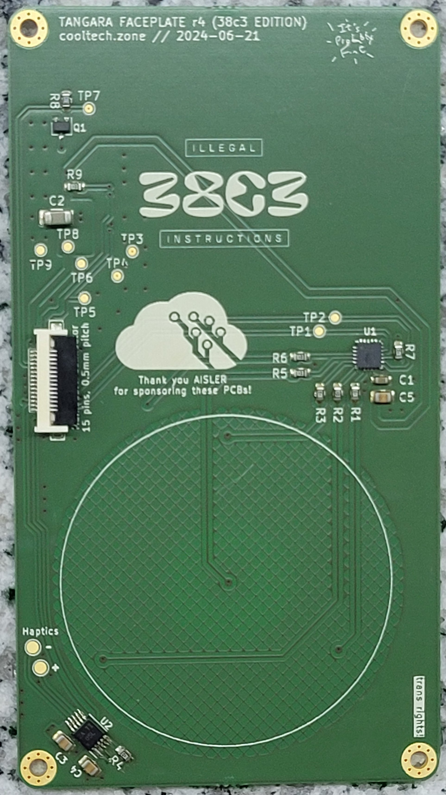

# Tangara-Workshop

## Kosten
Der Workshop kostet 100€. Am liebsten in Bar, im Notfall per Paypal.
## Voraussetzung
Erfahung mit dem SMD-Bestücken von Platinen oder gute Augen, eine ruhige Hand und Geduld. 
## Mitbringen
- Zwingend
    - Laptop/Tablet/Smartphone zum Betrachten der Anleitung
    - SD-Karte (qualitativ hochwertig)
- Optional
    - Außensechskant 3mm (z. B. https://www.amazon.de/dp/B001553QW8)
    - Torx T5 (z. B. https://www.amazon.de/dp/B0B61C6YSX)
    - Pinzette
    - Kopfhörer mit 3,5 mm Klinke
    - Kopfhörer mit Bluetooth

## Anleitung

### Schritt 1 - Bestücken der Top-Seite des Mainboards
Als erstes musst du die Datei [ibom_mainboard.html](ibom_mainboard.html) aus diesem Repository herunterladen (mit dem "Download raw file" Button) und im Browser öffnen. Die Datei (ibom) enthält eine Liste der Bauteile, die du bestücken musst und zeigt an, wo diese auf der Platine hingehören. Du musst als erstes die Top-Seite auswählen, indem du oben rechts den Button mit "F" auswählst. Topseite ist hier nicht als "Oberseite" im fertigen Tangara zu verstehen, sondern nur innerhalb der Platinenfertigung die als Oberseite deklarierte Seite. Wähle außerdem mit dem Zahnrad die Voreinstellung aus, dass "Pin 1" in der ibom Ansicht markiert werden soll, um sicherzustellen, dass du die Teile korrekt orientierst.

Nun wird die Topseite des Mainboards mit Lötpaste versehen, indem diese mit Hilfe der Lötschablone aufgerakelt wird.
Gehe hierzu zur Rakelstation dort bekommst du deine Mainboard-Platine.

Die Platine sollte ungeführ so aussehen:

**Bitte beachte, dass wir bleihaltige Lötpaste verwenden, weshalb du darauf achten solltest, in den Pausen immer deine Hände zu waschen, bevor du etwas isst oder trinkst.**

Ist die Platine mit Lötpaste versehen, bekommst du eine Sortierbox mit den Bauteilen für die Top-Seite der Mainboard Platine. Diese Bauteile musst du entsprechend der ibom mit Hilfe der Pinzette bestücken. Die Bauteile in der Sortierbox sind in der gleichen Reihenfolge angeordnet wie in der ibom.

Bitte beachte, dass L1 und L2 das gleiche Bauteil sind. Keine Ahnung warum es zwei Zeilen in der ibom gibt.

Bist du fertig mit dem Bestücken begib dich vorsichtig mit deiner Platine zur Backstation. Achte darauf, dass du nicht auf die Oberseite greifst und Teile verschiebst. Hier kommt die Platine zum ersten Mal in den Ofen.
Nach dem Backen sollte das Ganze so aussehen:

### Schritt 2 - Pause
Mache eine kleine Pause während der Ofen seinen Job erledigt. Es wird noch anstrengend genug. Das war erst der Anfang. Lauf eine Runde. Wasche deine Hände und trink einen Schluck Wasser, streck deinen Rücken, was auch immer dir hilft :)

### Schritt 3 - Bestücken der Bottom-Seite des Mainboards
Schalte die ibom für die Unterseite um, indem du oben rechts den Button "B" auswählst.

Gehe zur Rakelstation hier wird die Unterseite mit Lötpaste versehen.

Die Bauteile für die Bottom-Seite des Mainboards und der Faceplate bekommst du jetzt in einer weiteren Sortierbox.

Setze die Platine in die Bestückungshilfe. Ansonsten verfahre wie zuvor.

#############

Bitte beachte, dass es zwei Zeilen für 10k Widerstände gibt. Es handelt sich aber um das gleiche Bauteil.

Achte bei den Schaltern SW1 und SW2 darauf, dass sie korrekt, gerade und so weit innen wie möglich platziert sind.

Achte bei der USB-Buchse J6 darauf, dass die Beinchen zentral in den Langlöchern positioniert sind.

J1 und J7 sind THT Bauteile und werden nach dem Backen mit dem Lötkolben festgelötet, also nicht wundern wenn du dafür noch keine Teile hast.

Wenn du alle Teile platziert hast, sollte das folgendermaßen aussehen:

Bist du fertig mit dem Bestücken begib dich vorsichtig mit deiner Platine in der Bestückungshilfe zur Backstation. Hier kommt die Platine zum zweiten Mal in den Ofen.

### Schritt 4 - Pause
Mache eine kleine Pause während der Ofen seinen Job erledigt. Es ist noch ein gutes Stück. Siehe Pause 1.

### Schritt 5 - Festlöten des Akku-Steckers und der Audio-Buchse
Begib dich zur Reworkstation. Frage dort nach den Steckern. Dann bekommst du ein Tüte mit Bauteilen.

Löte mit dem Lötkolben den Akku-Stecker J7 fest.

Im Gegensatz zum Original verwenden wir einen Akku mit nur 2 Leitungen und deshalb auch nur eine Zweipolige Buchse. Setze die Buchse in die Bohrungen ein, die mit "VDD" und "GND" gekennzeichnet sind. Lasse "10k NTC" frei. 
Zur verdeutlichung nochmal als Bilder:

Löte dann die Audio-Buchse J1 fest.

HIER BILD EINFÜGEN

### Schritt 6 - Rework Mainboard
Begibt dich mit dem fertigen Mainboard zur Reworkstation. Dort wird geprüft, ob es Kurzschlüsse gibt und diese werden ggf. beseitigt. 

### Schritt 7 - Bestücken der Bottom-Seite der Faceplate
Lade die Datei [ibom_faceplate.html](ibom_faceplate.html) aus diesem Repository herunterladen und öffne sie im Browser. Schalte die ibom für die Unterseite um, indem du oben rechts den Button "B" auswählst.

Gehe zur Rakelstation dort bekommst du deine Faceplate-Platine. Hier wird die Bottom-Seite mit Lötpaste versehen.

Verfahre wie zuvor. Die Teile sind mit in der zweiten Box die du bekommen hattest.

Bist du fertig mit dem Bestücken begib dich vorsichtig mit deiner Platine zur Backstation. Hier wird zum dritten Mal gebacken.
Und auch hier gibt es ein Vergleichsbild:

### Schritt 8 - Pause
Mache eine kleine Pause während der Ofen seinen Job erledigt. Der Bestückungspart ist fast geschafft.

### Schritt 9 - Festlöten des Vibrationsmotors auf der Bottom-Seite der Faceplate
Suche in der Tüte nach dem Motor.

Löte den Vibrationsmotor an die beiden Pads die mit "Haptics" beschriftet sind. Rot an + und Blau an -.

### Schritt 10 - Festlöten des Displays auf der Top-Seite der Faceplate
Suche in der Tüte nach dem Display.

Setze die Platine in die Display-Positionierung-Hilfe.
Löte mit dem Lötkolben das Display fest.
Achte sehr genau darauf, dass die Kontakte des Kabels kongruent mit den Kupferpads auf der Platine platziert sind. Der orange Teil des Kabels sollte nahezu bündig mit dem Rand der Platine sein.

Fang erst mit den beiden ganz äußeren Pads an und frage dann nach ob das so passt. Korrekturen sind nur noch schwer möglich, wenn alles schon verlötet ist.

### Schritt 11 - Programmieren

Begibt dich mit der fertigen Faceplate zur Rework-Station. Dort wird geprüft, ob es Kurzschlüsse gibt und diese werden ggf. beseitigt. 

Gehe danach zur Programmierstation, dort werden die Controller mit Firmware versorgt und getestet ob alles funktioniert.

### Schritt 12 - Mechanischer Zusammenbau
Wenn alles funktioniert bekommst die Gehäuseteile. Alle anderen mechanischen Teile findest du in deiner Tüte.

Gehe zu deinem Platz zurück und breite die mechanischen Teile vor dir aus.
Du solltest nun folgende Komponenten vor dir haben:

- 4x Schrauben M2 kurz
- 4x Schrauben M2 lang
- 4x Distanzhülsen M2
- 1x Gehäuse Vorderseite
- 1x Gehäuse Rückseite
- 1x Touchwheel Cover
- 1x Faceplate
- 1x Mainboard
- 1x Akku
- 1x Halterahmen für den Akku
- 2x Druckknöpfe
- 1x Schiebeschalter
- 1x Abdeckung für die SD-Karte
- 1x Displayabdeckung

Einen Torx-Schraubendreher und einen Innensechskant musst du dir mit deinem Nachbarn teilen.

HIER BILD ERSETZEN OHNE SD KARTE!!!!!!!!!!!!!!!!

Schraube als erstes die langen Schrauben von unten in das Gehäuse für die Rückseite.

Platziere den Halterahmen für den Akku wie im Bild abgebildet. Auf der linken Seite des Bildes befindet sich die Öffnung für die Laut/Leiserbuttons.

Platziere den Akku wie im Bild gezeigt.

Setze das Mainboard auf die Schrauben. Achte darauf das Batteriekabel wie abgebildet zu verlegen.

Schraube die Distanzhülsen auf die Schrauben in den Ecken.
Stelle sicher, dass der Schalter auf "Aus" steht (untere Stellung). Schließe dann den Akku an.

Setze den Schiebeschalter ein. Achte darauf, dass du ihn vollständig einsetzt.

Jetzt wird es kniffelig. Klappe den schwarzen Arm am Stecker für das Flachbandkabel nach oben. Stecke das Flachbandkabel ein. Achte darauf, dass die blaue Seite nach oben zeigt und das Kabel vollständig eingesteckt ist. Klappe dann den schwarzen Arm herunter um das Kabel zu sichern.

Nimm die Faceplate-Platine und positioniere sie so, dass du auf der gegenüberliegenden Seite nun auch das Flachbandkabel einstecken kannst.

Klappe die Faceplate auf die Distanzhülsen. Achte darauf dass sich das Flachbandkabel korrekt zusammenfaltet.
Lege das Touchwheel Cover obenauf wie abgebildet.

Ziehe die Schutzfolie von der Displayabdeckung.
Vermeide mit deinen Fingern direkt auf die Flächen zu tippen um Fingerabdrücke zu vermeiden.

Ziehe die Schutzfolie vom Display und lege die Abdeckung vorsichtig auf das Display.

Jetzt wirds noch kniffeliger! Lege vorsichtig die vordere Abdeckung des Tangaras auf die Facplate, versuche vor allem die Displayabdeckung korrekt zu positionieren. Das Touchwheel kannst du auch von der Vorderseite richtig positionieren (im zusammengebauten Zustand). Wenn sich die Gehäusevorderseite bündig auf der Gehäuseunterseite positionieren lässt, hast du es fast geschafft.

Schraube den Tangara noch nicht zu! Jetzt musst du noch die Buttons hereinfummeln.
Am besten hälst du den Tangara mit einer Hand gerade so weit zusammen, dass die rechte Seite intakt bleibt und du die Buttons auf der linken Seite gerade so einschieben kannst. Die Bilder zeigen dir ungefähr wie.

Jetzt kannst du den Tangara zuschrauben. 
Falls du eine SD-Karte mitgebracht hast, kannst du noch die SD-Karten-Abdeckung aufstecken und du bist fertig!

## Weitere Informationen
- https://cooltech.zone/tangara/
- https://www.crowdsupply.com/cool-tech-zone/tangara
