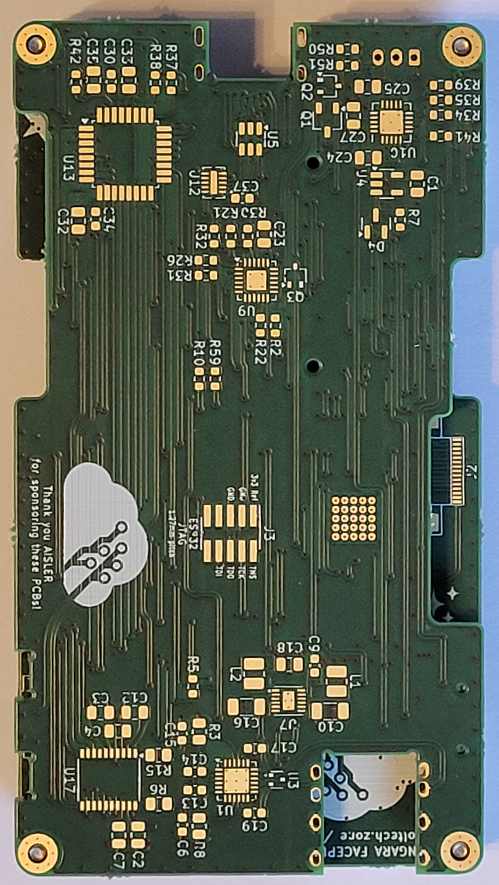
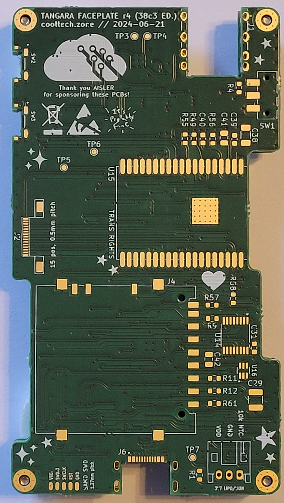
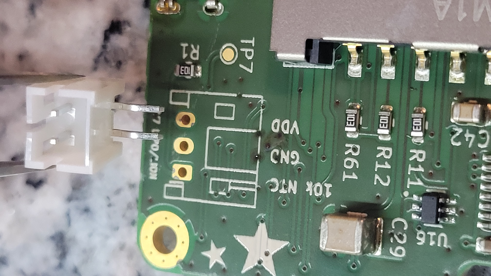
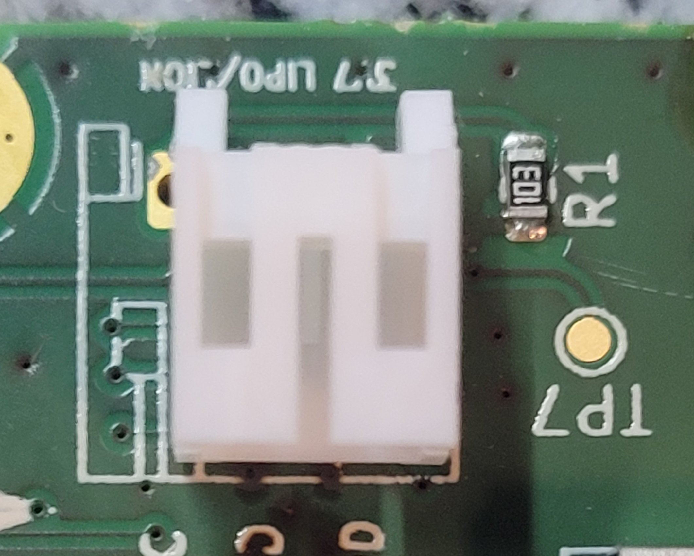
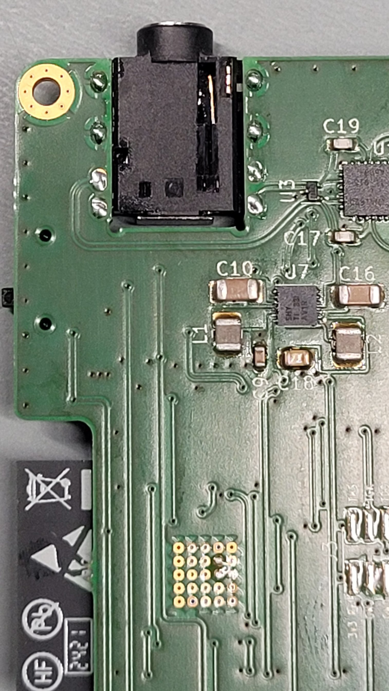
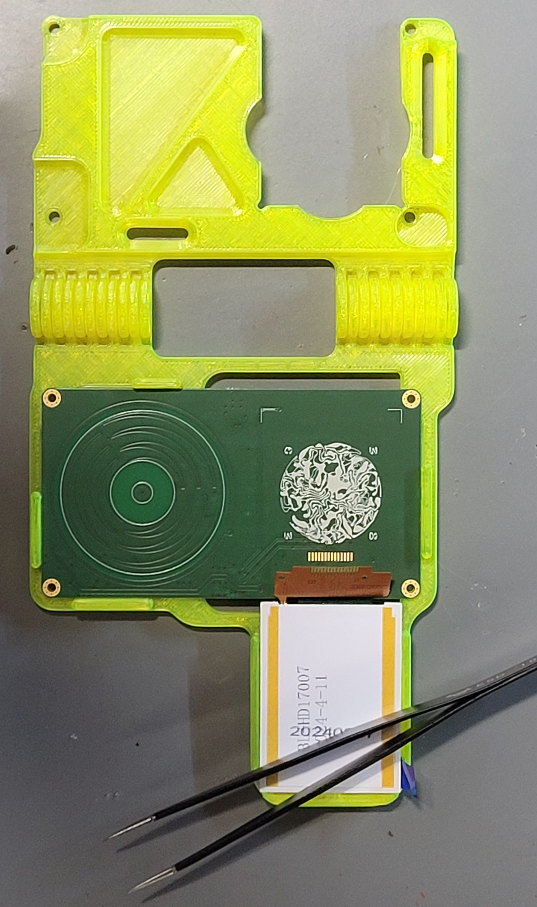
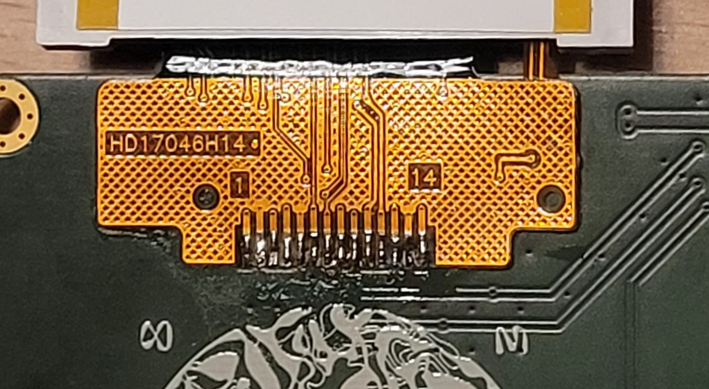
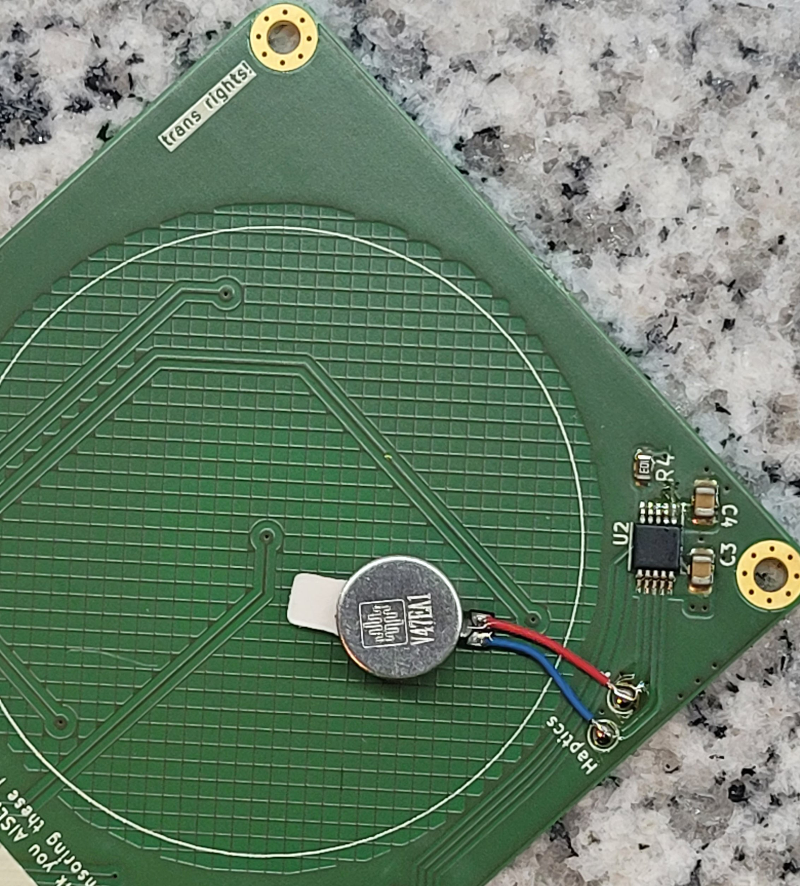
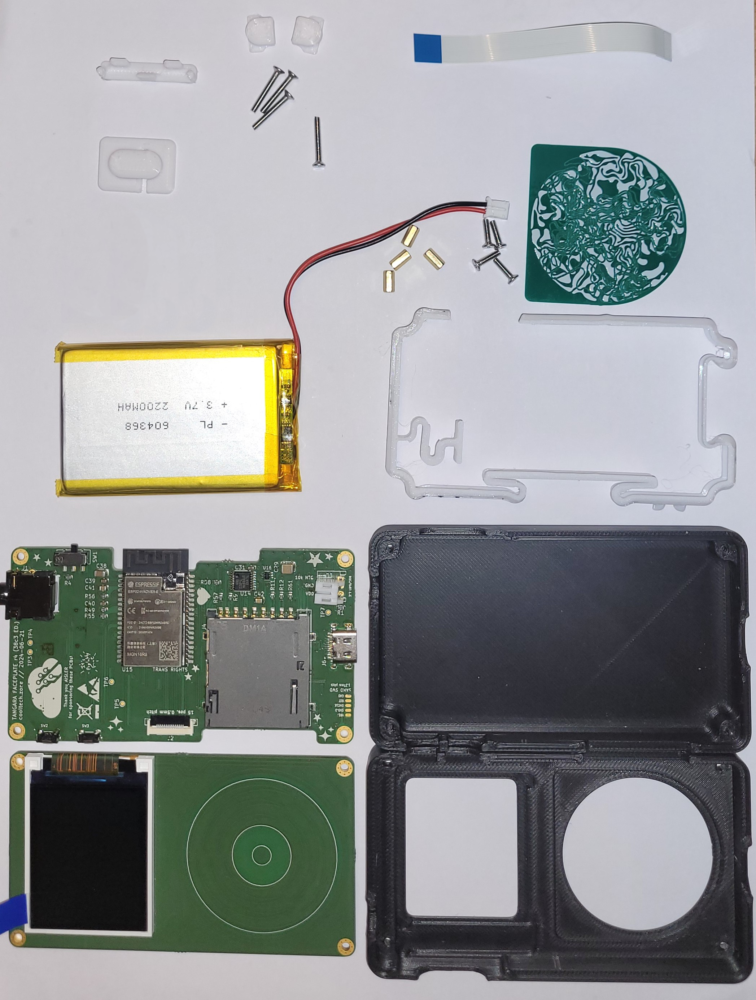

# Tangara workshop

## Costs
The workshop costs 100€. Preferably payable in cash, alternatively payable by Paypal.

## Prerequisites
Experience with SMD assembly of circuit boards or good eyes, a steady hand and patience. 

## Bring along
- Mandatory
    - Laptop/tablet to view the instructions
    - SD card (high quality)
- Optional
    - Allen wrench 3mm (e.g. https://www.amazon.de/dp/B001553QW8)
    - Torx T5 (e.g. https://www.amazon.de/dp/B0B61C6YSX)
    - Tweezers suitable for SMD work
    - Headphones with 3.5 mm jack
    - Headphones with Bluetooth
    - usb-c cable

## Instructions

Please read the relevant section **completely** before beginning each step.

### Overview
1. Assembling the mainboard, top side
1. Break 
1. Assembling the mainboard, bottom side
1. Break
1. Soldering THT parts
1. Programming and rework (if necessary)
1. Assembling the faceplate, bottom side
1. Break
1. Soldering the display
1. Soldering the vibration motor
1. Faceplate rework
1. Mechanical assembly

### Step 1 - Assembling the mainboard, top side
Firstly, you need to open the file [ibom_mainboard.html](https://html-preview.github.io/?url=https://github.com/casartar/Tangara-Workshop/blob/main/ibom_mainboard.html). The file (ibom) contains a list of the components you need to assemble and shows where they belong on the board. You must first select the top page by clicking on the ‘F’ button at the top right. Top side is not to be understood here as the ‘upper side’ in the finished Tangara, but simply the side declared as the top side within the PCB production. Also use the ibom settings (cogwheel top right) to select the default setting that ‘Pin 1’ should be marked in the ibom view on the selected part, to ensure that you orientate the parts correctly.

Once you have familiarised yourself with the instructions and IBOM, go to the squeegee station.
Here you will receive the board with solder paste already applied, in a holder, plus a sorting box with parts for the top side of the mainboard.

You have to assemble these components according to the ibom using the tweezers. The components in the sorting box are arranged in the same order as in the ibom.

**Please note that we use solder paste containing lead, so you should always make sure to wash your hands during breaks before eating or drinking anything.**

Please note that L1 and L2 are the same component. No idea why there are two lines in the ibom.

When you have finished placing the components, go to the baking station with your circuit board on the carrier. Make sure that you do not touch the top side and accidently move any parts. This is where the board goes into the oven for the first time.
After baking, it should look like this:

### Step 2 - Break
Take a short break while the oven does its job. It will be hard enough. This was just the beginning. Go for a run. Wash your hands and have a drink of water, stretch your back, whatever helps :)

### Step 3 - Assembling the mainboard, bottom side
Switch the ibom to the bottom side by selecting the ‘B’ button at the top right.

Go to the squeegee station. Here, we will apply solder paste to the bottom side.

You will now receive the components for the bottom side of the mainboard and the faceplate in another sorting box.

Place the board in the assembly aid. Otherwise proceed as before.

Please note that there are two lines in the ibom for 10k resistors. However, it is the same component.

Make sure that the SW2 and SW3 switches are positioned correctly, straight and as far inwards as possible.

With the USB socket J6, make sure that the legs are positioned in the centre of the slotted holes.

J1 and J7 are THT components and are soldered separately by hand. So don't be surprised if you don't have any parts for them yet.

When you have placed all the parts, it should look like this:

Once you have finished placing the parts, carefully move to the baking station with your PCB in the assembly aid. Here the board goes into the oven for the second time.

### Step 4 - Break
Take a short break while the oven does its job. There is still a good bit to go. See pause 1.

### Step 5 - Soldering the battery connector and the audio socket
Go to the squeegee station. Ask there for the connectors J1 and J7. You will then be given a bag of components.

Solder on the battery connector J7 with the soldering iron.

In contrast to the original design, we use a battery with only 2 leads and therefore only a two-pin socket. Insert the socket into the holes labelled ‘VDD’ and ‘GND’. Leave ‘10k NTC’ free. 

For clarification again as pictures:

Then solder the audio socket J1.

### Step 6 - Programming and rework
Take your finished mainboard in the holder to the programming station. We supply the mainboard with firmware and check it for short circuits and soldering errors. We also test the main functions of the mainboard here. If we notice anything during the test, we will rectify the errors at the rework station. In the meantime, you can continue with step 7.

### Step 7 - Assembling the bottom side of the faceplate
Open the file [ibom_faceplate.html](https://html-preview.github.io/?url=https://github.com/casartar/Tangara-Workshop/blob/main/ibom_faceplate.html) from this repository. Switch the ibom for the bottom side by selecting the ‘B’ button at the top right.

Go to the squeegee station where you will get your faceplate board, already with solder paste applied.

Proceed as before. The parts are in the second box you received.

Once you have finished assembling, carefully take your board to the baking station. Bake here for the third time.
For comparison how it should look, see the following picture:

### Step 8 - Break
Take a short break while the oven does its job. The assembly part is almost done.

### Step 9 - Soldering the display
Look for the display in the bag. The display is soldered to the top side of the faceplate.

Place the board in the display positioning aid.

Make very sure that the contacts of the cable are positioned congruently with the copper pads on the board. The orange part of the cable should be almost flush with the edge of the circuit board. If necessary, use sellotape if you are unsure. You can get some from us.

Solder the display in place with the soldering iron.

Start with the two outer pads first and then work your way forward. Corrections are difficult to make if everything is already soldered, so ask us if you are unsure.

The solder should flow through the small holes in the flexible conductor track onto the circuit board underneath.

**Do not glue the display yet!**

### Step 10 - Soldering the vibration motor
Look for the motor in the bag. The vibration motor is soldered to the bottom side of the faceplate.

Solder the vibration motor to the two pads labelled ‘Haptics’. Red cable to + and blue cable to -. After soldering, remove the protective film from the vibration motor and stick it on. Make sure that the cables lie flat and without mechanical stress.

### Step 11 - Faceplate rework
Take the finished faceplate to the rework station. There we will check whether there are any short circuits and fix them if necessary. 
Here you will also receive the ribbon cable that connects the two boards.

### Step 12 - Mechanical assembly
If everything works, you will receive the housing parts. You will find all the other mechanical parts in your bag.

Go back to your seat and spread out the mechanical parts in front of you.
You should now have the following components in front of you:

- 4x M2 screws, short
- 4x M2 screws, long
- 4x M2 spacer sleeves M2
- 1x enclosure front
- 1x enclosure rear
- 1x touchwheel cover
- 1x completed faceplate
- 1x completed mainboard
- 1x ribbon cable 
- 1x battery
- 1x holding frame for the battery
- 2x cap for volume buttons
- 1x cap for slide switch (power)
- 1x cover for the SD card
- 1x transparent display cover

You will have to share a Torx screwdriver and a hexagon socket with your neighbour.

First, insert the long screws from below into the rear encloser.

Place the holding frame for the battery as shown in the picture. On the left side of the picture is the opening for the volume up/down buttons.

Place the battery as shown in the picture.

Place the mainboard on the screws. Make sure to position the battery cable as shown.

Screw the spacer sleeves onto the screws in the corners.
**Make sure that the switch is in the ‘off’ position (lower position)**. Then connect the battery.

Insert the slide switch cap. Make sure that it is fully inserted.

Now it gets tricky. On the mainboard: Carefully fold up the black cover on the connector for the ribbon cable. Plug in the ribbon cable. Make sure that the blue side is facing upwards and that the cable is fully inserted. Then fold down the black cover to secure the cable in place.

Take the faceplate board and position it so that you can now also plug in the ribbon cable on the opposite side.

Fold the faceplate onto the spacer sleeves. Make sure that the ribbon cable folds up correctly.
Place the touchwheel cover on top as shown.

Remove the protective film from the transparent display cover.
Avoid touching the surface directly with your fingers to prevent fingerprints.

Remove the protective film from the display and carefully place the cover on the display.

Now it gets even trickier! Carefully place the front cover of the Tangara on the faceplate, be careful to try to position the display cover correctly. You can also position the touchwheel correctly later from the front (when assembled). If the front of the housing can be positioned flush with the bottom of the housing, you're almost there.

Don't screw the tangara shut yet! Now you have to fiddle in the buttons.
It's best to hold the tangara together with one hand just enough so that the right side remains intact and you can just about push the buttons in on the left side. The pictures show you roughly how.

Now you can screw the Tangara shut. 
If you have brought an SD card with you, you can attach the SD card cover and you're done!

## Further information
- https://cooltech.zone/tangara/
- https://www.crowdsupply.com/cool-tech-zone/tangara
